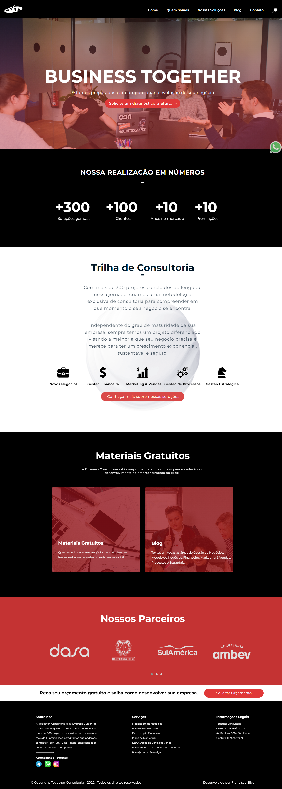

# Business Landing Page

This Business Landing Page is a website designed to promote a company and showcase its products or services. The website uses modern web development technologies such as HTML, CSS, JavaScript, Bootstrap, and jQuery to create an interactive and engaging website.

## Features

- Sleek and modern design
- Mobile-responsive for seamless viewing on any device
- Interactive elements to engage visitors
- Clear calls-to-action
- Easy navigation
- Integration with social media platforms

## Technologies Used

- HTML5: Used to structure the website's content and layout.
- CSS3: Used to style the website's layout and design, including color schemes, typography, and animations.
- JavaScript: Used to add interactivity and dynamic elements to the website, such as pop-ups, sliders, and form validation.
- Bootstrap: A popular CSS framework used for responsive design and pre-built UI components.
- jQuery: A JavaScript library used for simplifying and enhancing JavaScript code, such as event handling and animations.

## Usage

To view the website, simply visit the live site or download the project files and open the `index.html` file in your preferred web browser. The website can be easily customized and modified to fit your specific business needs.

## Contributing

Contributions to this project are welcome! Feel free to fork this repository and submit a pull request with your changes.

## Credits

This project was built by [Francisco Silva](https://github.com/Burntroll).

## License

This project is licensed under the [MIT License](https://opensource.org/licenses/MIT).

## Results

